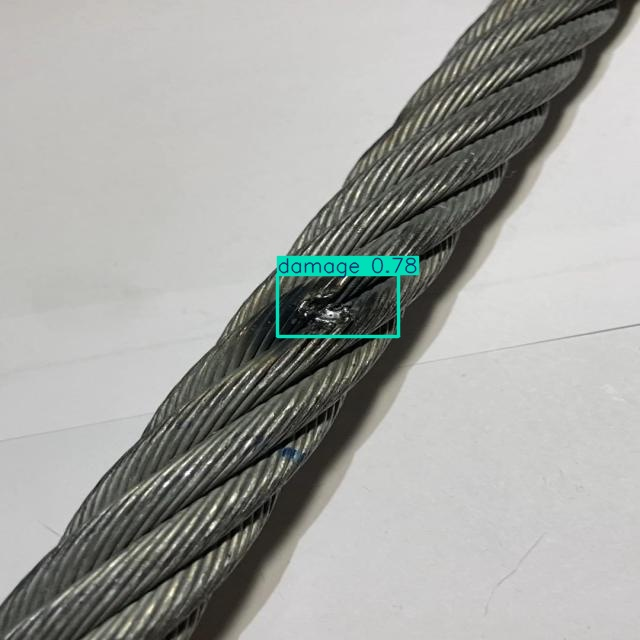
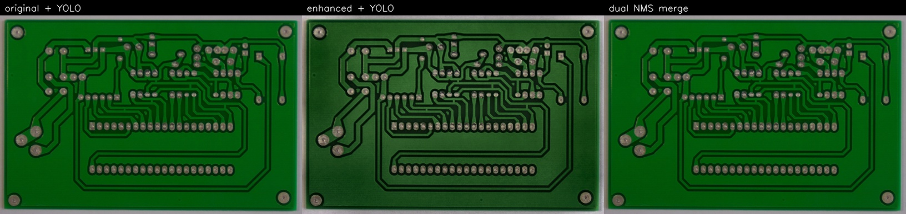
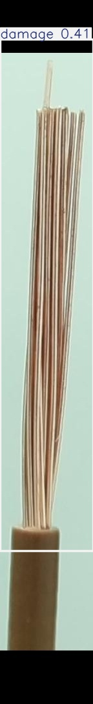
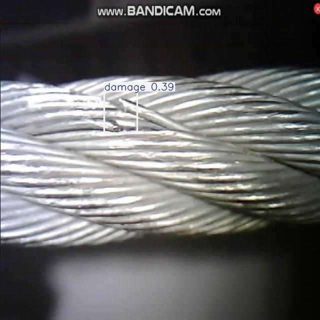
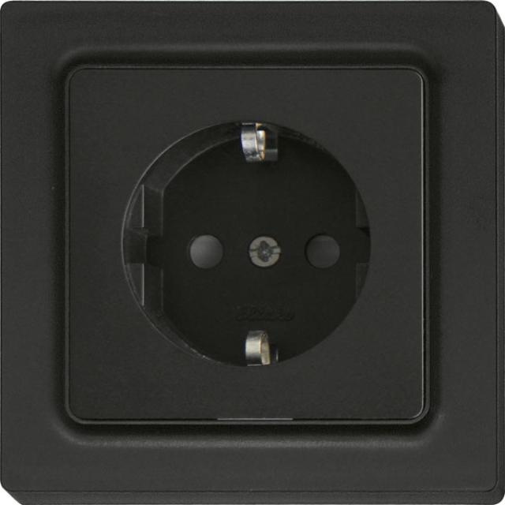
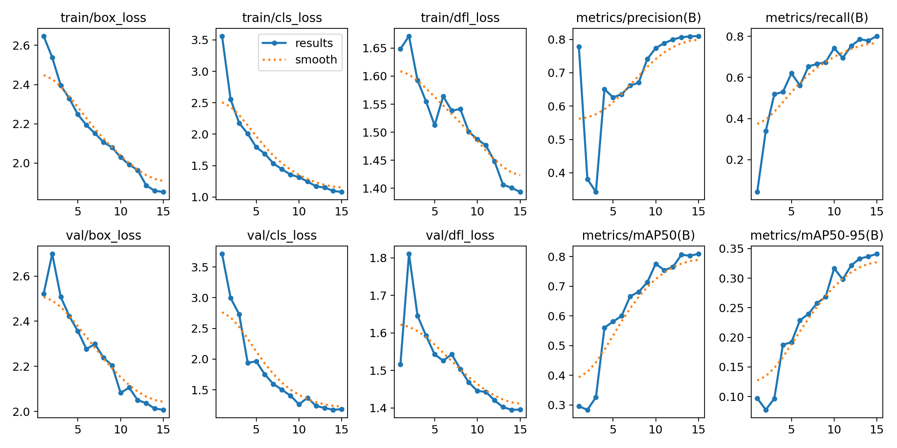
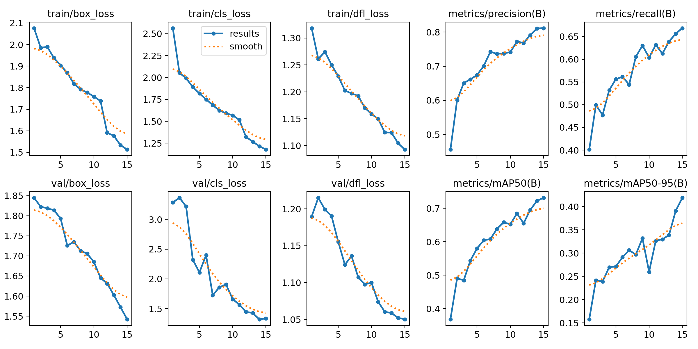

# Circuit Fault Vision

Screen **visible** electrical / PCB / cable defects with a small YOLO detector. Bounding boxes mark the problem. This is a screening aid, not an electrical certificate. Never print “safe.” Live panels: electrician only.

**Gallery:** [`results/presentable/index.html`](results/presentable/index.html) (open locally in a browser).

<p align="center">
  
  
</p>
<p align="center"><sub>Left: outdoor cable <code>break</code> at 0.71 (test mAP50 <b>0.888</b>). Right: defect-only PCB — open 0.85, short 0.88, damage 0.75–0.79 (precision <b>0.81</b>).</sub></p>

## Results (this repo’s models)

All numbers are **held-out test** scores from YOLOv8n trained on CPU (320 px). These are **not** paper figures (Tao 98.7%, Chen 99% simulation).

| Demo | Weights | Test mAP50 | Precision / Recall | What it actually sees |
|------|---------|------------|--------------------|------------------------|
| Outdoor cable damage | [`models/investor_proof.pt`](models/investor_proof.pt) | **0.888** | 0.84 / 0.91 | Broken / thunderbolt marks on metal cables |
| PCB + cable (4-class) | [`models/circuit_faults.pt`](models/circuit_faults.pt) | **0.831** | 0.93 / 0.77 | Includes an easy `complete` class (mAP50-95 0.995) — do not use as “circuit OK” |
| **Defect-only mix** | [`models/home_faults.pt`](models/home_faults.pt) | **0.713** | **0.81 / 0.68** | Product ontology: `open` / `short` / `damage` only |
| Synthetic home wires | [`models/home_wires.pt`](models/home_wires.pt) | 0.76 | 0.70 / 0.69 | Color drawings. Not real board photos |

**Best public RGB proof:** outdoor cable-damage **mAP50 0.888**.

**Product-aligned model** (`home_faults`, no `complete` class):

| Class | Test mAP50 | Test mAP50-95 |
|-------|------------|---------------|
| open | **0.747** | 0.435 |
| short | 0.629 | 0.328 |
| damage | **0.764** | 0.464 |
| **all** | **0.713** | 0.409 |

Headline 0.713 is lower than 0.831 because the easy full-board `complete` boxes were dropped. **Short** is the weakest class. Precision **0.81** on the defect-only test set.

Write-up: [`knowledge_base/FINDINGS.md`](knowledge_base/FINDINGS.md) · [`research/HOME_FAULTS.md`](research/HOME_FAULTS.md)

## Detections (proof stills)

Boxes sit on the defect, not the whole board.

<p align="center">
  
  
</p>
<p align="center"><sub>Cable <code>damage</code> and color-PCB shorts — tight boxes, not a “circuit complete” crop.</sub></p>

<p align="center">
  
</p>
<p align="center"><sub>Dual merge: keep original boxes, add extras from CLAHE/sharpen. Original defect precision <b>0.809</b>.</sub></p>

<p align="center">
  
</p>
<p align="center"><sub>Same cable: damage confidence <b>0.59 → 0.70</b> after sharpen; dual keeps the better score on the original photo.</sub></p>

<p align="center">
  
  
  
</p>
<p align="center"><sub>Defect-only model: stripped-wire <code>damage</code>, outdoor cable <code>damage</code>, normal socket with <b>no box</b> (empty ≠ safe).</sub></p>

<p align="center">
  
  
</p>
<p align="center"><sub>Training curves: cable-damage (mAP50 0.888) and defect-only mix (mAP50 0.713).</sub></p>

## Quick start

```bash
pip install -r requirements.txt
python -m src.infer --preset cable_damage
python -m src.infer --preset home_faults --hide-complete
```

Weights are in `models/` (~5.3 MB each, included in this repo). Training datasets are **not** committed (size + licenses); download scripts recreate them.

```bash
python -m src.download_cable_damage
python -m src.train --preset cable_damage
```

## Data sources (used in training)

Public **images** stay on their original hosts. We only commit code, weights, and proof stills. Cite these if you reuse the work.

| Dataset | Role in this repo | n (approx.) | License | Reference |
|---------|-------------------|-------------|---------|-----------|
| Roboflow 100 **cable-damage** | Outdoor `break` / `thunderbolt`; also `damage` in later mixes | 1,318 | CC BY 4.0 | [HF LibreYOLO/cable-damage](https://huggingface.co/datasets/LibreYOLO/cable-damage) · [Roboflow](https://universe.roboflow.com/roboflow-100/cable-damage) |
| **PKU-Market-PCB / HRIPCB** | Color PCB photos → open / short / damage | ~1.3k used in merge | research-use PCB set | [HF RobotHuman/PCB_defect](https://huggingface.co/datasets/RobotHuman/PCB_defect) |
| **DeepPCB** | Real CCD traces → open / short / damage | ~1.5k used in merge | research-use | [HF thangkt/PCB-Prune-YOLO-DeepPCB](https://huggingface.co/datasets/thangkt/PCB-Prune-YOLO-DeepPCB) · [DeepPCB](https://github.com/tangsanli5201/DeepPCB) |
| **PCB-IND** | Real AOI patches; open/short + other defects → damage | 4,789 | CC BY 4.0 | [Zenodo 10.5281/zenodo.19723114](https://doi.org/10.5281/zenodo.19723114) |
| **Stripped Wire** | Cut / pulled strands → `damage` | 167 defect close-ups | research (Zenodo) | [Zenodo 10.5281/zenodo.16686806](https://doi.org/10.5281/zenodo.16686806) |
| Indoor sockets / switches | Empty-label **backgrounds** (normal sockets are not defects) | 760 used | CC BY 4.0 | [Zenodo 10.5281/zenodo.18835199](https://doi.org/10.5281/zenodo.18835199) |

Full catalog (including sets we **did not** train on): [`research/datasets.md`](research/datasets.md).

**Not in the mix (gated or wrong domain):** Roboflow HazardDetector / electrical-hazards (~6k burned sockets — needs `ROBOFLOW_API_KEY`); EnergAI fuses (3.4 GB locator); 13 GB auto-labeled panels; MVTec cable (CC BY-NC-SA, no commercial use); overhead HV sets (TTPLA, CPLID, CableInspect-AD).

Public PCB / outdoor cable photos **are not** Pakistani residential consumer units. Do not quote these mAP numbers as field accuracy on a home DB.

## What this is / is not

| Can flag | Cannot flag |
|----------|-------------|
| Visible strand breaks, PCB opens/shorts, insulation damage in the photo | In-wall / hidden wiring |
| | “The circuit is complete / safe” |
| | Radiometric ΔT / overload without a thermal camera under load |

RGB finds **visible** damage. Heat needs a **radiometric** IR camera and NETA/NFPA ΔT rules — not Ultralytics movement heatmaps. ByteTrack is for video IDs only.

## Repo layout

| Path | Purpose |
|------|---------|
| `results/presentable/` | **Show this** — gallery + named stills |
| `models/*.pt` | Trained YOLOv8n weights |
| `src/` | Download, merge, train, infer |
| `research/` | Datasets, ontology, two-scale plan, investor proof |
| `knowledge_base/FINDINGS.md` | Snapshot of metrics |

## Safety

Screening aid only. Does not replace a licensed electrician, insulation tests, or NFPA 70B / NETA thermography. Opening live panels is an arc-flash / shock hazard.
