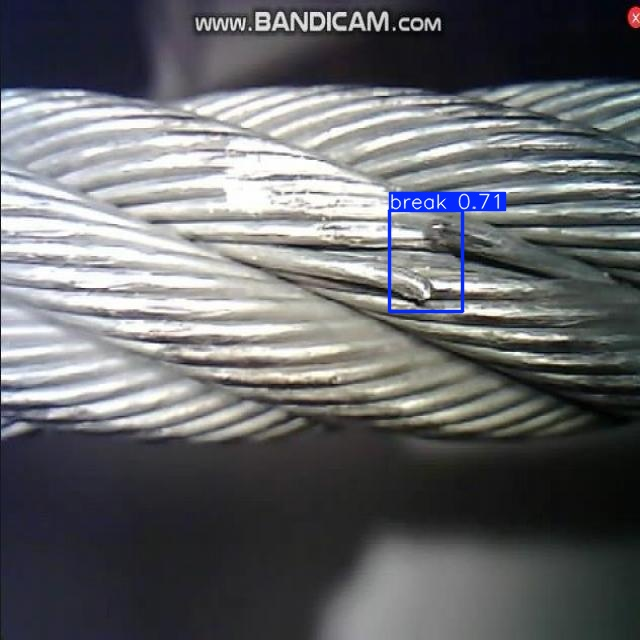
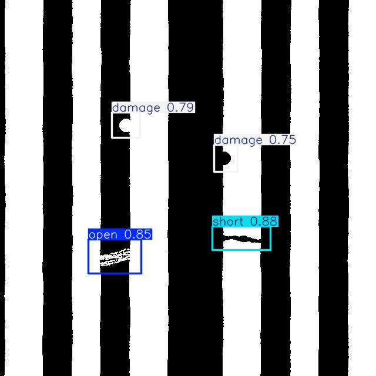
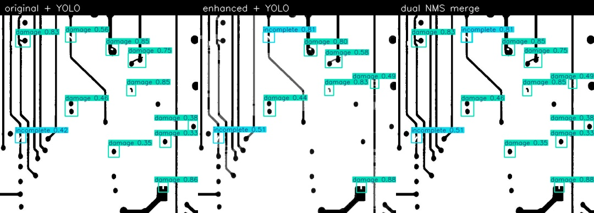
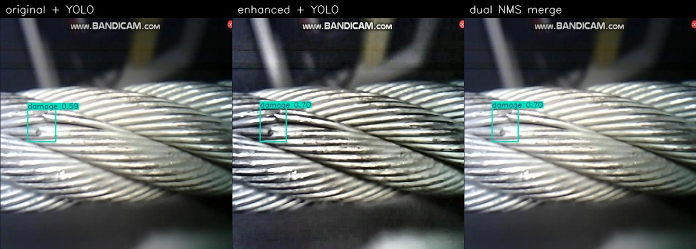

# Findings

**Date:** 2026-08-30  
**Gallery:** [`results/presentable/index.html`](../results/presentable/index.html)

Screening aid. Boxes mark a **visible** problem. Empty detections = nothing visible in this photo, not “safe.” Live panels: electrician only.

## Headline results (this project, test split)

| Demo | Weights | Test mAP50 | Precision / Recall |
|------|---------|------------|--------------------|
| Outdoor cable damage | `models/investor_proof.pt` | **0.888** | 0.84 / 0.91 |
| PCB + cable (4-class) | `models/circuit_faults.pt` | **0.831** | 0.93 / 0.77 |
| Defect-only mix | `models/home_faults.pt` | **0.713** | **0.81 / 0.68** |
| Synthetic home wires | `models/home_wires.pt` | 0.76 | 0.70 / 0.69 |

YOLOv8n, 320 px, CPU. Do **not** quote Tao 98.7% or Chen 99% (simulation) as these scores.

### Defect-only model (`home_faults`) — product ontology

No `complete` class. Fine-tuned from `circuit_faults.pt`, 15 epochs, ~5.6 h CPU. Train 7,084 / val 1,028 / test 987.

| Class | Test mAP50 | Test mAP50-95 |
|-------|------------|---------------|
| open | **0.747** | 0.435 |
| short | 0.629 | 0.328 |
| damage | **0.764** | 0.464 |
| **all** | **0.713** | 0.409 |

Precision **0.810** · recall **0.681**. Headline 0.713 is lower than 0.831 because easy full-board `complete` boxes (mAP50-95 0.995 on the 4-class run) were dropped. Short is the weakest class.

### Dual-pass CLAHE / sharpen (same `circuit_faults.pt`, 484 test images)

Keep original boxes. Do not replace the photo.

| Mode | True defects | False boxes | Precision | Recall |
|------|--------------|-------------|-----------|--------|
| Original YOLO | 1254 | 296 | **0.809** | 0.735 |
| Enhanced image only | 1144 | 194 | 0.855 | 0.671 |
| Dual merge | **1257** | 342 | 0.786 | **0.737** |

Tiles at conf 0.25: precision 0.12 — not default.

## Data sources

| Dataset | Used for | License | Link |
|---------|----------|---------|------|
| Roboflow 100 cable-damage | Outdoor break/thunderbolt; later `damage` | CC BY 4.0 | https://huggingface.co/datasets/LibreYOLO/cable-damage |
| PKU-Market-PCB / HRIPCB | Color PCB open/short/damage | research-use | https://huggingface.co/datasets/RobotHuman/PCB_defect |
| DeepPCB | CCD traces open/short/damage | research-use | https://github.com/tangsanli5201/DeepPCB |
| PCB-IND | Real AOI open/short/damage | CC BY 4.0 | https://doi.org/10.5281/zenodo.19723114 |
| Stripped Wire | Cut/pulled strands → damage | Zenodo research | https://doi.org/10.5281/zenodo.16686806 |
| Indoor sockets / switches | Empty-label home backgrounds | CC BY 4.0 | https://doi.org/10.5281/zenodo.18835199 |

Catalog: [`research/datasets.md`](../research/datasets.md). Images are **not** in git; download scripts recreate `data/public/`.

PCB / outdoor cable mAP is **not** accuracy on a Pakistani consumer unit or burned socket. HazardDetector (~6k home hazards) still needs a Roboflow API key.

## Do not claim

In-wall faults, “board is safe,” paper mAP as this model’s score, 0.713 as burned-socket field accuracy.
