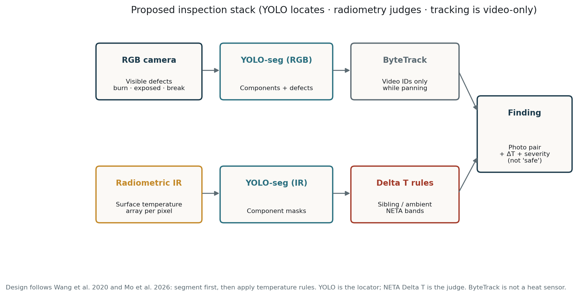
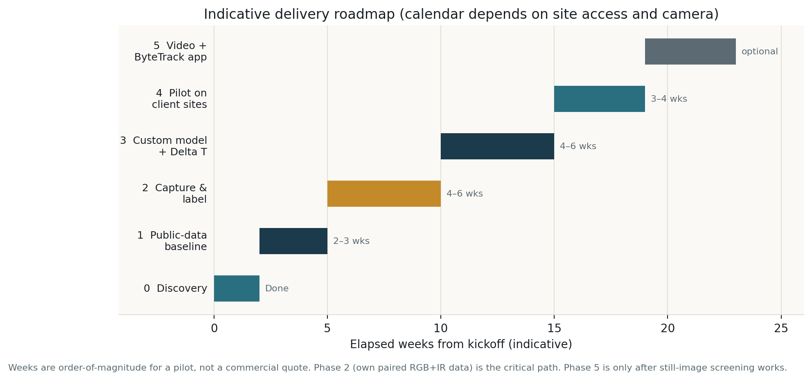
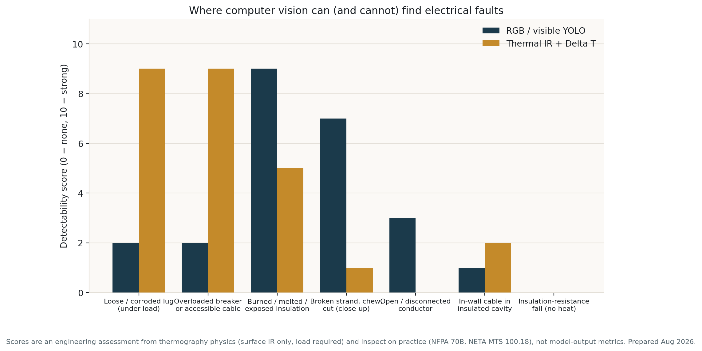

# Project proposal

## AI-assisted visual and thermal screening of electrical circuits and wiring

**Prepared for:** [Client name / organisation]  
**Prepared by:** [Your name / organisation]  
**Date:** 16 August 2026  
**Document:** Detailed technical and work proposal (pilot)  
**How to send:** Open `PROPOSAL_DETAILED.html` in a browser → Print → Save as PDF. Replace the bracketed names before sending.

---

## Cover note

This document is a working proposal for a pilot project. It states, in order:

1. **What we are trying to achieve**
2. **What we will investigate** (the questions, fault types, equipment, and limits)
3. **What we will actually do** (work packages and deliverables)
4. **How we will do it** (the process, from kickoff through a site pilot)
5. **What we will not claim**, and what we need from you

The method is not speculative. Infrared thermography is already used by electricians to find hot joints and overloaded circuits. Academic work from 2012–2026 shows that **YOLO-style detectors can find equipment in thermal images**, and that **severity should be scored from temperature difference (Delta T)**, not from a model guessing “loose lug” versus “overload.” What does *not* exist is a ready-made model for **your** distribution boards. That is the work of this pilot: collect paired visible and thermal pictures of accessible electrical equipment, train a detector on that domain, and produce a repeatable screening report that a qualified person can act on.

This is a **screening aid**. It does not replace a licensed electrician, an insulation-resistance test, or a statutory inspection.

---

## 1. Purpose

Electrical problems that start fires or take a building offline often announce themselves as **heat** (a loose or corroded connection, an overloaded breaker or cable) or as **visible damage** (burned insulation, exposed copper, a chewed or broken sheath). Today those signs are found by a person with a torch and, if available, a thermal camera. Results vary with skill, load at the time of the visit, and how carefully each frame is reviewed.

We propose to build a **repeatable inspection pipeline** that:

- photographs the accessible electrical system in **visible light** and **radiometric infrared**;
- **locates** boards, breakers, busbars, lugs, cables, and obvious visible defects automatically;
- **measures** how much hotter a part is than its neighbours and than ambient air;
- **ranks** findings using published thermography bands (NETA MTS Table 100.18; NFPA 70B practice);
- **hands a report** to a qualified electrician — two photos, a location, a Delta T, a suggested action — never a stamp that says the installation is “safe.”

If the pilot succeeds, you will have: a labeled dataset of *your* equipment, a trained model that runs on still images (and later video), a written capture protocol, and a clear list of what the system can and cannot see.

---

## 2. Objectives of the pilot

| ID | Objective | How we will know it is met |
|----|-----------|----------------------------|
| O1 | Prove the software toolchain on public thermal and cable-damage images | A trained YOLO baseline and a short demo on public data |
| O2 | Capture a paired visible + thermal dataset of **your** accessible boards and cable runs, under load | 300–800 labeled paired frames across several boards, with metadata |
| O3 | Train detectors that find components and visible defects on *your* equipment | Reported mAP on a **held-out board** (not a random split of the same panel) |
| O4 | Score heat using Delta T inside each detected part | Sibling and ambient ΔT written into the report; NETA band attached |
| O5 | Produce a still-image screening report a person can use on site | Visible photo + thermal photo + ID + ΔT + load note + action band |
| O6 | State detection limits in writing | User-facing “cannot detect” list signed off with you |
| O7 | (Optional, after O5) Track the same part across a pan video | ByteTrack IDs; no duplicate alerts for one hot lug |

Commercial fees, intellectual property, and a production rollout are **out of this document** and would be a separate agreement after the pilot.

---

## 3. What will be investigated

This is the investigation agenda. Every item below is something we will **study, measure, or explicitly rule out** — not a promise that the software will “find all electrical problems.”

### 3.1 Equipment we will look at (in scope)

We will investigate **accessible** electrical equipment only:

- Main and sub **distribution boards / consumer units** (closed cover, then open dead-front with a qualified electrician)
- **MCBs / MCCBs / RCDs**, incoming lugs, neutral and earth bars, busbars
- **Accessible cable tails**, tray or surface runs, glands, and junctions that can be photographed without demolition
- **Sockets, switches, and isolators** where a thermal and visible pair can be taken under load
- Optional later: cable trays in plant rooms, generator / UPS boards, if you provide access

We will **not** investigate, in this pilot:

- Conductors buried in plaster, insulation, or conduit with no surface heat
- Underground services
- High-voltage yards / UAV line inspection (that literature exists; it is a different product)
- Live work by anyone other than a person qualified under your safety rules

### 3.2 Fault types we will investigate

For each type we will record: *can vision see it, under what conditions, and how we will test that claim.*

| Fault / condition | What we investigate | Visible (RGB) | Thermal (IR + ΔT) | How we will test it |
|-------------------|---------------------|---------------|-------------------|---------------------|
| Loose or corroded lug / terminal | Does it run hotter than a sibling on the same bus under load? | Weak (discoloration only) | Strong if loaded | Capture under load; electrician-confirmed cases; optional staged loose lug on a **training board only** |
| Overloaded breaker or undersized accessible cable | Is the device / cable hotter than neighbours carrying similar duty? | Weak | Strong if loaded | Two load levels if possible; clamp-meter note |
| Failing / hot breaker | Localised heat on one pole vs the bank | Weak | Strong | Sibling ΔT on the same row |
| Phase imbalance (where 3-phase exists) | Are the three phases thermally inconsistent? | No | Medium | Compare three phase conductors / poles in one frame |
| Burned, melted, or carbonised insulation / plastic | After-the-fact visible damage | Strong | Medium (heat may be gone) | RGB close-ups; labeled `burn_mark` / `melted_plastic` |
| Exposed copper / missing sheath | Visible conductor | Strong | No (unless also hot) | RGB labels `exposed_conductor` |
| Broken strand, cut, chew (close-up) | Mechanical damage on accessible cable | Medium–strong | No | RGB close-ups; discarded cable samples allowed |
| Scorch marks on bus or dead-front | Evidence of past heating / arcing | Medium | Strong if still hot | Paired photos |
| Open / disconnected conductor | Break with no current | Only if the break is visible | **No** (no heat) | We document this as **out of thermal reach** |
| In-wall / insulated-cavity cable fault | Surface temperature on plaster | Almost never | Rare, faint | We will **attempt a few wall scans** only to **show the limit**, not to sell the feature |
| Insulation-resistance / earth / polarity failure with no heat | Electrical test faults | No | No | Explicitly **not investigated as a CV task**; remains an electrician test |
| Intermittent fault not present at capture | Load/time dependent | No | No | We investigate **capture timing and load protocol**, not magic detection |
| Reflections and emissivity errors (false hot/cold on shiny metal) | When IR lies | — | We will study this | Sibling ΔT; notes on shiny copper; optional high-e tape in lab |

### 3.3 Operating conditions we will investigate

The camera only sees what is true **at the moment of capture**. We will therefore investigate:

- **Load:** captures at low load versus typical / peak load (aim ≥ ~40% of typical circuit load, NFPA 70B practice). We will tag any frame taken under light load as `low_load_unreliable`.
- **Cover on vs cover off:** what a homeowner can scan versus what an electrician can scan with the dead-front removed.
- **Distance and angle:** whole-board shot versus close-up of lugs; off-axis shots that distort IR.
- **Ambient temperature** and obvious HVAC / sun on the board.
- **Palette vs radiometry:** false-colour JPEG versus per-pixel temperature. We will require radiometric files for Delta T.
- **Camera class:** if you already own a thermal camera, we will investigate whether it is radiometric enough; if not, we will specify a minimum (FLIR One Pro class or better).

### 3.4 Technical questions we will investigate (R&D inside the pilot)

These are the engineering investigations, with a written answer at the end of each phase:

1. **Does off-the-shelf YOLO (COCO) see breakers and cables?** Expected answer: no. We confirm it so we do not skip training.
2. **Does a model trained on public substation / switchgear IR transfer to your boards?** Expected answer: poorly. We measure the gap (this justifies your own data).
3. **Is YOLO-seg (masks) better than boxes for temperature?** We compare mean °C in a mask versus a loose box that overlaps the next pole.
4. **Should severity come from a neural-net class (`overload`) or from Delta T?** We will implement Delta T as the judge (Wang 2020; Mo 2026; NETA). Class names like “loose vs overload” will *not* be the v1 output.
5. **RGB only vs IR only vs both?** We will report findings that RGB catches, IR catches, and both catch — so you see why two cameras are worth it.
6. **What is the false-clear rate?** A hot, confirmed fault that the system misses. This is the **primary safety metric**, more important than a high mAP.
7. **What is the false-alarm rate?** Reflections, warm but healthy transformers, sun patches.
8. **Is video + ByteTrack useful on a handheld pan?** Investigated in an optional last phase, only after stills work.
9. **Can we run on a laptop, or do we need a small server / Jetson?** Measured in Phase 3 (FPS, model size).

### 3.5 Standards and literature we will investigate against (not reinvent)

- **NFPA 70B (2023) §7.4** — measure and document Delta T of similar components under similar load, and versus ambient.
- **ANSI/NETA MTS Table 100.18** — action bands for ΔT.
- **Wang et al., IEEE TIM 2020** — segment the object in IR, then apply temperature rules.
- **Mo et al., Scientific Reports 2026** — same pattern on circuit breakers.
- **Liu et al., IEEJ 2025** — find the component first, then the hotspot (cascade).
- **Zhang et al., ECCV 2022 (ByteTrack)** — keep identity in video; not a heat sensor.
- **Jadin & Taib, 2012** — heat often precedes electrical failure; IRT is the right measurement.

We will not claim 95–99% field accuracy because those published numbers are on **substations, switchgear, or simulated cables**, not on your consumer units.

---

## 4. What we will do (work we will deliver)

The project is six work packages. Package 0 is already done (this research). You approve 1, then 2–4. Package 5 is optional.

### WP0 — Discovery (complete)

- Literature and dataset survey
- Feasibility limits (in-wall, open circuit, unloaded)
- This proposal and capture protocol

**You receive:** this document, the shorter overview, and the paper notes.

### WP1 — Toolchain and public-data baseline

**We will:**

- Set up training (Ultralytics YOLO-seg)
- Download 1–2 public sets (e.g. RGB cable-damage; IR equipment / thermal boards)
- Train a throwaway baseline
- Run it on a few photos of *generic* panels to show the **domain gap**

**You receive:** a short demo (images with boxes), a one-page note: “public models do / do not match your boards.”

**We will not:** call this the production model.

### WP2 — Site capture and labeling (critical path)

**We will:**

- Specify the camera (radiometric minimum)
- Write a shot list and metadata template
- Attend (or remotely supervise) capture with **your qualified electrician**
- Photograph: closed cover, open board, close-ups (lugs, neutral bar, each bank), optional second load, 10–20 s pan video
- Label RGB (components + visible defects) and IR (components) in YOLO-seg format
- Split data **by board ID** (e.g. boards A–C train, D validate, E test)

**You receive:** the raw paired set (held privately), the label guide, and a count of images per class.

**You provide:** site access, electrician, load at capture time, permission to photograph, anonymised site codes (no names/addresses in files).

### WP3 — Custom model and Delta T engine

**We will:**

- Fine-tune YOLO-seg on your RGB and IR labels
- Read radiometric temperature inside each IR mask
- Compute ΔT vs siblings and vs ambient; map to NETA bands
- Fuse RGB defects + IR severity into a finding list
- Build a still-image report generator (two photos + numbers)

**You receive:** model weights (pilot), a script or simple UI to run one pair of images, example reports, and an accuracy note on the held-out board.

### WP4 — Pilot on held-out sites

**We will:**

- Run the system on boards the model has not trained on
- Sit with the electrician to mark true / false findings
- Measure false-clears and false alarms
- Write an SOP: how to stand, how much load, how to read the report
- Freeze the “cannot detect” list for anyone who uses the tool

**You receive:** a pilot report, error gallery, SOP, and a go / no-go recommendation for a later product phase.

### WP5 — Video (optional)

**We will:** add ByteTrack so a hot breaker keeps ID 4 while panning; suppress duplicate alerts; optional dwell overlay **on the panel**, not a crowd-movement heatmap.

**We will not** start WP5 until still images are trustworthy.

---

## 5. Process — how the work will run

This is the operating process, start to finish.

```
Kickoff → WP1 baseline → Camera & access confirmed
       → WP2 capture days → Labeling → Board-wise split
       → WP3 train + ΔT → Internal review
       → WP4 live pilot + electrician review → SOP + limits
       → (optional) WP5 video tracking
       → Close-out pack
```

### 5.1 Kickoff (half day)

We agree in writing:

- Sites and board types in the pilot
- Who the qualified person is for open-panel work
- Camera: you supply / we specify a purchase
- Whether a **training board** may be used for staged faults (never on a live customer board in a dangerous way)
- Anonymisation rules
- That the software must never display “safe” / “passed inspection”

### 5.2 Capture process (each board, same every time)

1. Note ambient °C, time, and a load note (what is on: HVAC, cooking, machines). Clamp meter if available.
2. **Closed cover:** RGB + IR (homeowner view).
3. Electrician opens the dead-front under their rules.
4. **Whole board:** RGB + IR, square-on, no sun, no AC blasting the copper.
5. **Close-ups:** incoming lugs, neutral/earth bar, each bank of breakers, any discoloration.
6. Repeat a subset at a **second load** if the site allows.
7. **10–20 s pan** video for later tracking tests.
8. Save files with one ID stem (`site03_boardB_shot07`) plus a small JSON (cover open/closed, load, ambient, camera, radiometric yes/no).
9. Electrician may mark `known_issue=true` on a shot if they already know a defect — that becomes a gold label, not a class name of “overload vs loose.”

### 5.3 Labeling process

- Tool: Roboflow or CVAT; export YOLO-seg.
- **RGB classes (v1):** `board`, `breaker`, `busbar`, `cable`, `outlet`, `lug`, plus defects `burn_mark`, `exposed_conductor`, `broken_cable`, `melted_plastic`.
- **IR classes (v1):** the same **component** names. We do **not** spend weeks labeling IR as “overload” versus “loose connection”; heat is scored by Delta T.
- Two people can spot-check a 10% sample of labels.
- Train / val / test = **different boards**, so the number we report is honest.

### 5.4 Training and measurement process

1. Start from COCO-pretrained YOLO-seg (nano or small for speed, medium if the GPU allows).
2. Optional pretrain on public IR / cable sets, then fine-tune on your data.
3. Prefer **temperature arrays** as input for IR if the camera SDK allows; otherwise radiometric JPEG decoded to °C, not rainbow-only PNG.
4. After detection: for each IR mask, compute T_mean / T_max, ΔT_sibling, ΔT_ambient, NETA band.
5. If load was low, attach `low_load_unreliable` so nobody treats a quiet image as a pass.
6. Metrics we will publish to you:
   - mAP@0.5 for localisation (components and visible defects)
   - **False-clear rate** on electrician-confirmed hot faults (the dangerous error)
   - False-alarm rate on healthy sibling breakers
   - A short gallery of mistakes (reflections, overlap, missed small lugs)

### 5.5 Report process (what the user sees)

Every finding is a row:

- Track / object ID  
- Component type (breaker, lug, cable, …)  
- Visible defect? (yes/no + class)  
- T and ΔT_sibling / ΔT_ambient  
- NETA-style action (investigate / repair as time permits / immediate)  
- Load note and cover on/off  
- Side-by-side RGB and IR crop  

The footer of every report: **“Screening only. Absence of a finding is not evidence the installation is safe. A qualified person must interpret results.”**

### 5.6 Review and close-out process

- Joint review with your electrician on the held-out board.
- We write what failed and whether more data or a tighter shot list would fix it.
- Go / no-go for a later product (app, more sites, video).
- Handover: protocol, label guide, example reports, model for the pilot, this limits list.

---

## 6. How a finding is decided (the actual logic)

We will not let a single neural network invent an electrical diagnosis.

```
IF RGB shows a labeled visible defect above threshold
    → raise a visible finding
IF IR mask has ΔT_sibling or ΔT_ambient in NETA “investigate” or worse
    AND load is adequate
    → raise a thermal finding
IF both
    → raise a combined finding (highest trust)
IF load is low
    → any “no thermal finding” is tagged unreliable
NEVER
    → print “installation OK”
```

This follows Wang (2020) and Mo (2026): **the network finds the object; the temperature rule (and a person) find the fault.**



---

## 7. What you will get (deliverables)

| # | Deliverable | When |
|---|-------------|------|
| D1 | This proposal + capture protocol + paper notes | Now |
| D2 | Public-data baseline demo and domain-gap note | End of WP1 |
| D3 | Camera specification (minimum radiometric) | Start of WP2 |
| D4 | Labeled paired dataset of agreed sites (private) | End of WP2 |
| D5 | Trained RGB and IR YOLO-seg (pilot weights) | End of WP3 |
| D6 | Delta T scoring module + still-image report samples | End of WP3 |
| D7 | Pilot accuracy pack: mAP, false-clears, error gallery | End of WP4 |
| D8 | Site SOP for the electrician / operator | End of WP4 |
| D9 | Written limits of detection (user-facing) | End of WP4 |
| D10 | Optional: video tracking demo | WP5 |

Indicative duration (not a quote): WP1 2–3 weeks; WP2 4–6 weeks (depends on access); WP3 4–6 weeks; WP4 3–4 weeks.



---

## 8. What we need from you

Without these, the process stops at WP1.

1. **Written agreement** that this is screening, not a certified inspection.  
2. **Site list** and permission to photograph (interiors anonymised).  
3. A **qualified person** to open live panels under your safety rules. We will not open live gear ourselves unless that is separately contracted and legal.  
4. **Load during capture** — empty buildings hide faults. Evening / production load is better.  
5. **Camera path:** provide a radiometric imager, or approve a specified purchase. Phone screenshots of a thermal app are not enough for Delta T.  
6. **Time for a review session** with the electrician on the pilot report.  
7. Decision after WP1: proceed to capture (WP2) or stop.

---

## 9. What we will not do in this pilot

- Claim to see wiring inside walls as an X-ray would  
- Replace insulation-resistance, earth-loop, RCD, or polarity tests  
- Issue an EICR or any statutory certificate  
- Let the software say “safe” or “pass”  
- Train on your data and then publish identifiable interiors  
- Quote 99% accuracy from simulated or substation papers as *your* expected result  
- Start video tracking before still-image screening works  
- Stage dangerous faults on a live installation that serves occupants  

---

## 10. Safety

Opening an energised board is an **arc-flash and shock** hazard. Capture with the cover off is done only by a person qualified to do that work, with their PPE and isolation rules. We treat every thermal “all quiet” as **not a bill of health**. Unloaded circuits, closed covers, shiny metal, and intermittent faults will be called out in the SOP so operators do not over-trust the tool.

---

## 11. Risks (and what we do about them)

| Risk | What we do |
|------|------------|
| Your boards look nothing like public datasets | WP1 measures the gap; WP2 is mandatory |
| Camera has no radiometry | We stop Delta T and say so; specify a camera |
| Capture on a quiet Sunday | Tag `low_load_unreliable`; reschedule peak load |
| Shiny copper looks falsely hot or cold | Sibling comparison; lab tape optional; error gallery |
| Too few real faults in the wild | Training-board staged faults (safe, electrician-led); oversample defects in training |
| Someone reads “no box” as “no danger” | Report footer and SOP; never print “safe” |
| Label leakage (same board in train and test) | Split by board ID |

---

## 12. Detectability at a glance (honest picture)



Thermal is for **heat under load** on accessible metal. Visible YOLO is for **damage you can already see**. Together they cover the useful slice. Neither covers a dead open circuit or a megger failure with no heat.

---

## 13. Decision we ask you to make

Please reply with:

1. **Yes / no** — the use case is accessible boards, trays, and junctions (not in-wall tomography).  
2. **Yes / no** — you can provide electrician + loaded capture windows.  
3. **Camera** — you have a radiometric unit / you want a specification to buy.  
4. **Approve WP1** (public-data baseline) now, with WP2 gated on a short written go-ahead after the domain-gap demo.

If you want a shorter briefing for a second reader, use `CLIENT_PROPOSAL.html`. This document is the detailed statement of work.

---

## 14. Selected references

1. Jadin & Taib, *Infrared Physics & Technology*, 2012 — IRT and electrical reliability.  
2. Wang et al., *IEEE Trans. Instrumentation and Measurement*, 2020 — IR instance segmentation then temperature rules.  
3. Xia et al., *High Voltage*, 2021 — IRT diagnostics, detect then measure.  
4. Zhang et al., ByteTrack, ECCV 2022.  
5. NFPA 70B 2023 §7.4; ANSI/NETA MTS Table 100.18.  
6. Tao et al., *Applied Sciences*, 2025 — YOLOv8 on substation IR.  
7. Liu et al., *IEEJ*, 2025 — cascaded component then thermal-defect YOLO.  
8. Mo et al., *Scientific Reports*, 2026 — breaker segmentation + temperature density.  

Full paper-by-paper crux notes: `papers.md`.
